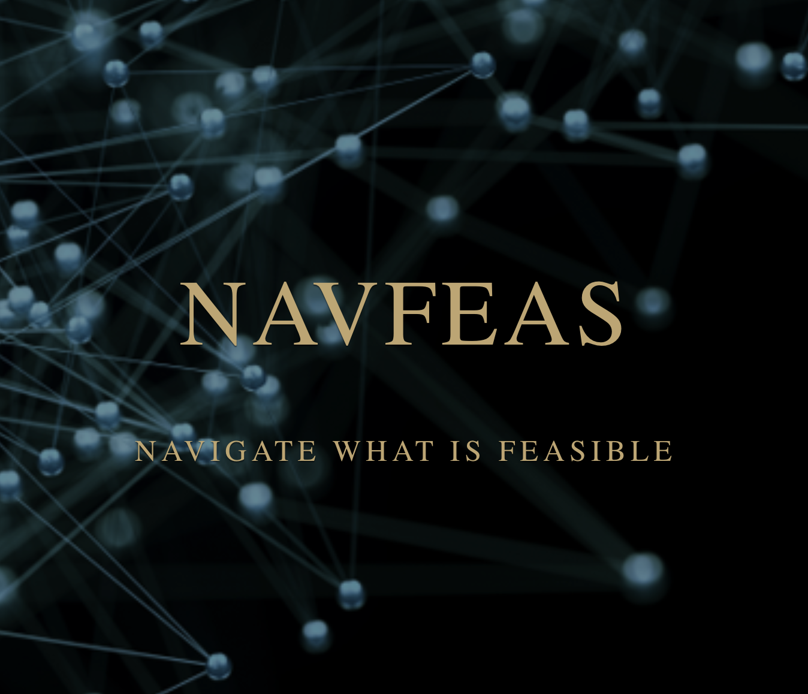
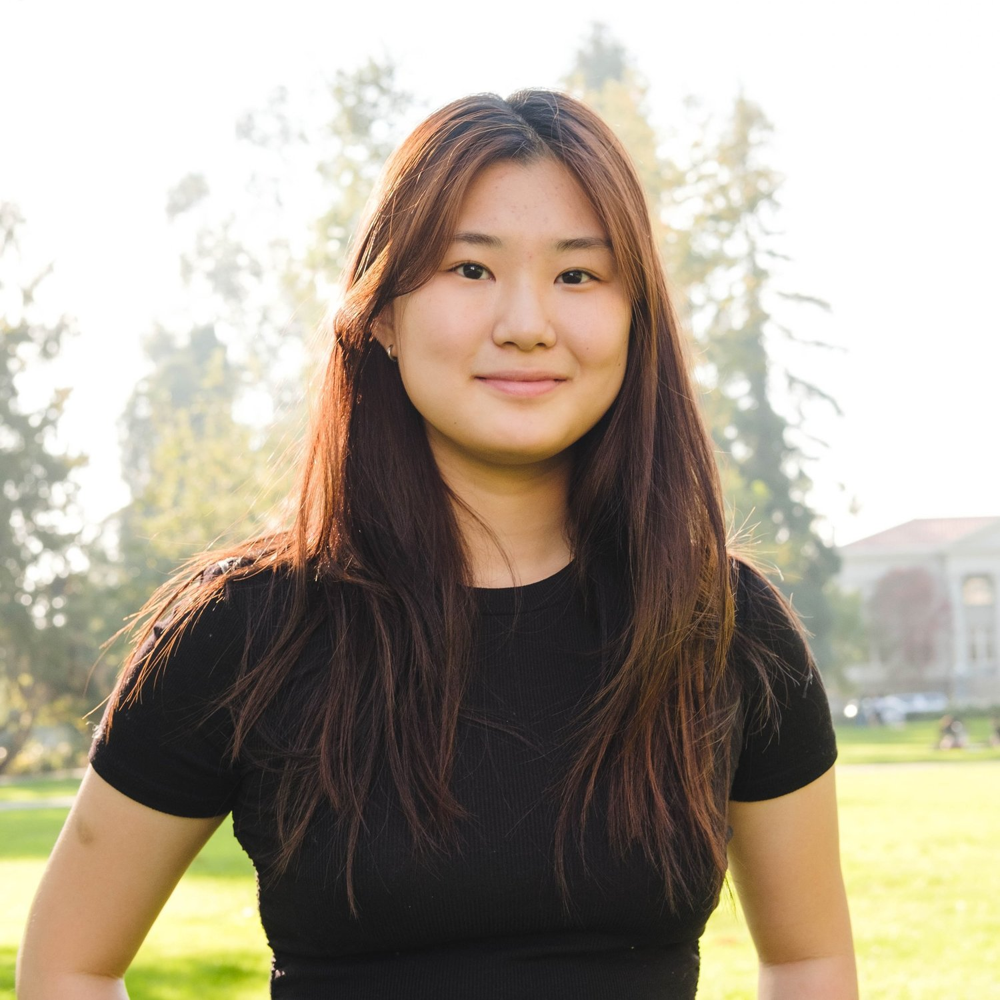
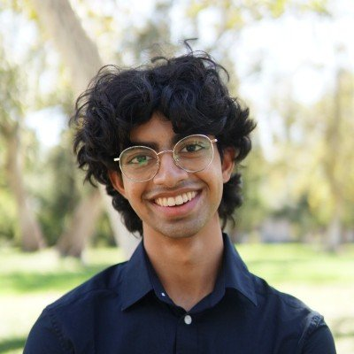
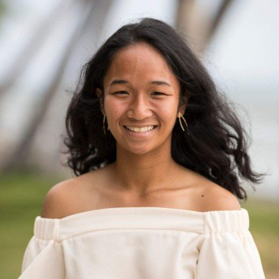
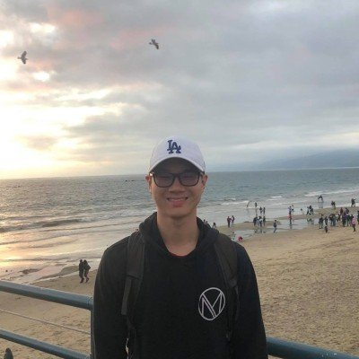
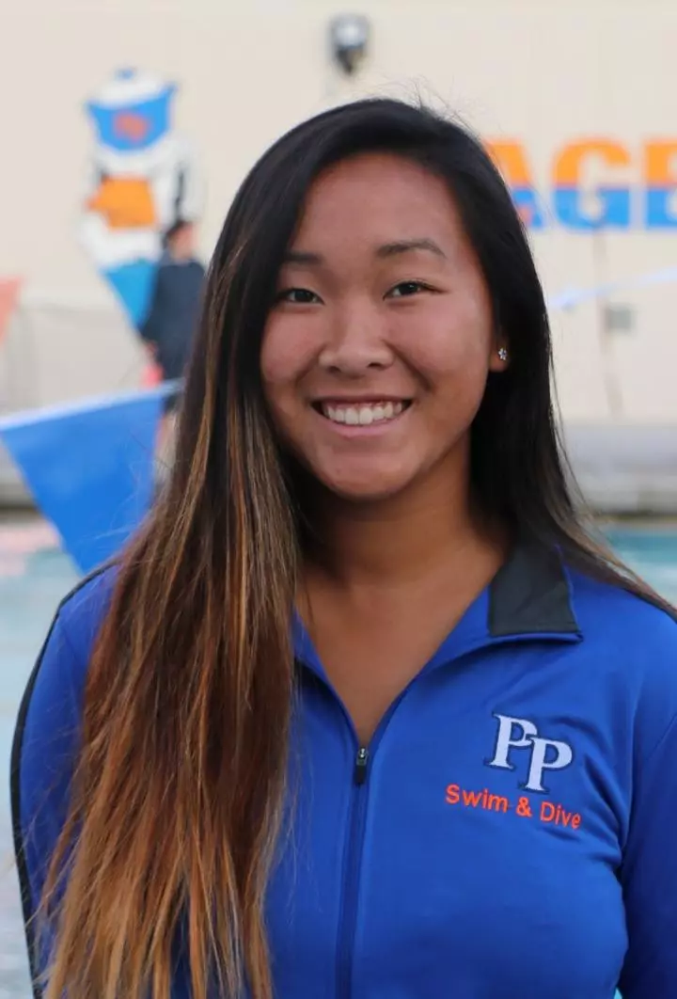
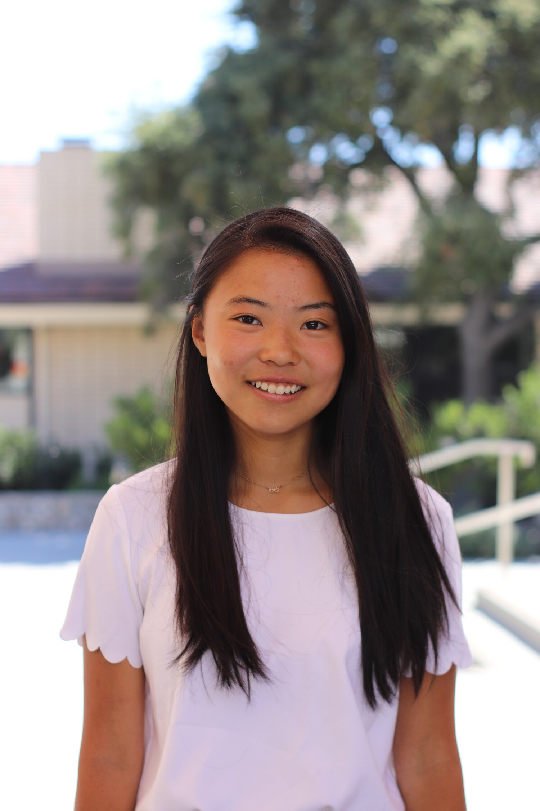
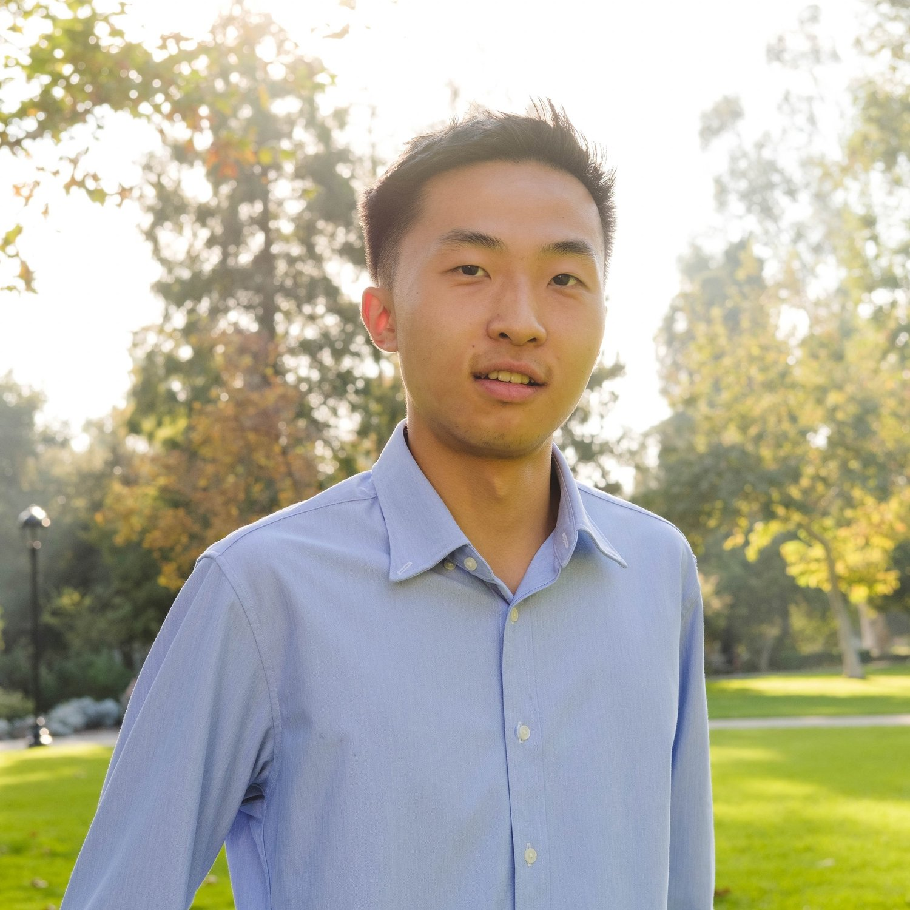
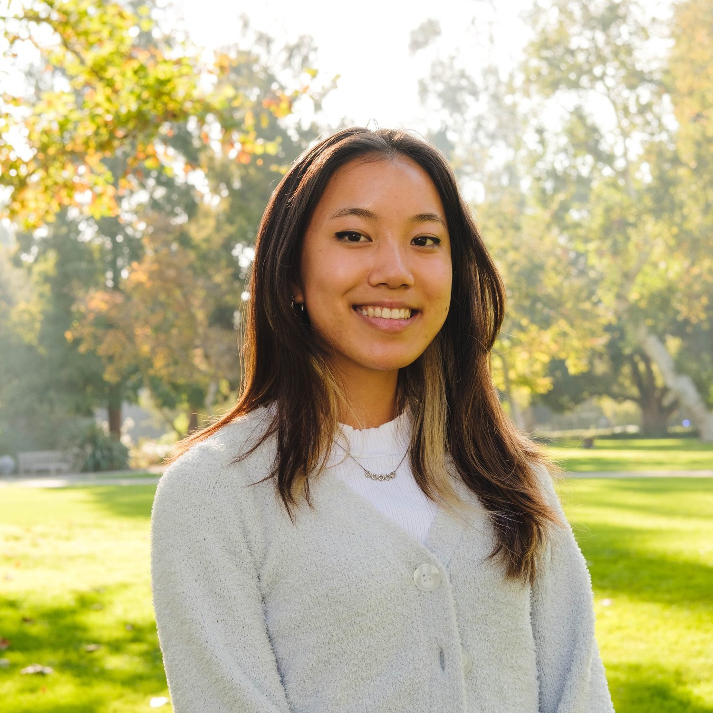

<!DOCTYPE html>
<html lang="en">
<head>
    <meta charset="UTF-8">
    <meta name="viewport" content="width=device-width, initial-scale=1.0">
    <title>People</title>
    
</head>
<body>
    <!-- P-ai Leadership -->
    <h1>Meet the P-ai Leadership</h1>
    

        

            
            <h2>Sae Furukawa</h2>
            
President

            
Pomona '25

            
Computer Science

        

        

            
            <h2>Jayhyun Suh</h2>
            
Vice President

            
Pomona '26

            
Math/Cognitive Science

        

        

            
            <h2>Asya Lyubavina</h2>
            
Director of Marketing and Design

            
Pomona '26

            
Computer Science

        

    

    

        

            
            <h2>Aimee Co</h2>
            
Director Of Projects

            
Harvey Mudd '26

            
Computer Science/Math

        

        

            
            <h2>Abrar Yaser</h2>
            
Director of Projects

            
Pomona '25

            
Computer Science

        

        

            
            <h2>Dylan O'Conner</h2>
            
Director of Projects

            
Pomona '26

            
Computer Science

        

    

    
    <!-- Advisory Board -->
    

        <h1>Advisory Board</h1>
        
<a href = "http://www.cs.pomona.edu/~dkauchak/" target="_blank"> David Kauchak</a> (Pomona College)

        
<a href = "https://www.cs.hmc.edu/~montanez/" target="_blank"> George Montañez</a> (Harvey Mudd College)

        
<a href = "https://www.scrippscollege.edu/offices/profile/michael-spezio" target="_blank"> Michael Spezio </a>(Scripps College)

        
<a href = "https://www.crunchbase.com/person/avery-bedows" target="_blank"> Avery Bedows</a> (Neurotechnology Specialist Loup Ventures)

        
<a href = "https://www.crunchbase.com/person/ron-sege" target = "_blank"> Ron Sege</a> (Partner Benhamou Global Ventures)

        
<a href = "https://www.linkedin.com/in/aashita-kesarwani/" target = "_blank">Aashita Kesarwani</a> (HMC Scientific Computing Specialist/ML Researcher)

        
<a href = "https://bright1993ff66.github.io/Resume/" target="_blank">HaoLiang Chang </a>(CityU HK PhD Student/NLP Researcher)

        
<a href = "https://bsky.app/profile/agstrait.bsky.social" target="_blank">Andrew Strait </a>(DeepMind Researcher)

    

    <!-- Partners -->
    

        <h1>Partners</h1>
        
Please send an email to p.ai.claremont@gmail.com if you are interested in partnering or sponsoring P-ai!

        

            

                
            

            

                
            

            

                
            

            

                
            

        

    

    
    <!-- Alumni -->
    

        <h1>P-ai Alumni</h1>
        

            

                
                <h3>Hannah Mandell</h3>
                
Managing Director

                
Pomona '23

                
This is additional information that appears on hover.

            

            

                
                <h3>Bansi Patel</h3>
                
Director of Marketing

                
Scripps '23

                
Bansi is an alumni at Scripps College, who studied Media Studies and Psychology. She is interested in the role AI can play in social media monitoring and marketing. Outside of P-ai, Bansi has experience in marketing in the semiconductor industry. In her free time, Bansi enjoys photography, videography, and graphic design.

            

            

                
                <h3>Waverly Wang</h3>
                
Director of Design

                
Harvey Mudd '25

            

            

                
                <h3>Andy Liu</h3>
                
Director of Projects

                
Harvey Mudd

            

            

                
                <h3>Alex Ker</h3>
                
Founder

                
Pomona

            

        

        

            

                
                <h3>Tai Xiang</h3>
                
Project Manager

                
p-yum: Quantifying the Culinary side of YouTube 

                
Pomona

            

            

                
                <h3>Jacob Zimmerman</h3>
                
Project Manager

                
P-sync

                
Pomona

            

            

                
                <h3>Nikolas Papastavrou</h3>
            

            

                
                <h3>Marcos Acosta</h3>
                
Director of Projects

                
P-ASL Project Manager

                
Harvey Mudd

            

            

                
                <h3>Michael Lee</h3>
                
Project Manager

                
P-agent

                
Claremont McKenna

            

        

        

            

                
                <h3>Sophia Epstein</h3>
                
Project Manager

                
p-PET

                
Claremont McKenna

            

            

                
                <h3>Varun Bopardikar</h3>
                
Managing Director

                
Pitzer

            

            

                
                <h3>Marwan Bit</h3>
                
Project Manager

                
p-music: AI-Generated Album Ratings

                
Harvey Mudd '25

            

            

                
                <h3>Zac Davis</h3>
                
Project Manager

                
<a href="https://docs.google.com/document/d/1JNg2dKvUoyJu4OiK47wWQ3E6oSsQfsYjPfgkCP_Kg-I/edit?tab=t.0#heading=h.h5ghr4yvf1pp" target="_blank">p-okémon: Pokémon Battle Engine</a>

                
Claremont McKenna '24

            

            

                
                <h3>Rachel Yang</h3>
                
Director of Events

            

        

        

            

                
                <h3>Saatvik Kher</h3>
                
Project Manager

                
<a href = "https://docs.google.com/document/d/1WH6Yi6u8a3c_GAeRdc3mlEMIYcwPYOTKg044vfyWZx4/edit?tab=t.0#heading=h.mkb6nexdlkr2"  target="_blank">p-recommender: Interactive Course Recommender for 5C Students</a>

                
Pomona '24

            

            

                
                <h3>Taylor Venenciano</h3>
                
Project Manager

                
<a href = "https://docs.google.com/document/d/1i9PuWptIY8uMR9-i3c-oE2-FF2tt3Qoj7gcC72EQT9k/edit?tab=t.0#heading=h.mkb6nexdlkr2" target="_blank"> p-laying_soccer: UEFA Soccer Match Prediction</a>

                
Pomona '23

            

            

                
                <h3>Arjun Govind</h3>
                
Project Manager

                
<a href = "https://docs.google.com/document/d/1s3mQwcG99Ojq7AFSOUyYcsvEcDSZVoNPQk9FaULEgiY/edit?tab=t.0#heading=h.hg4u2olerq8t" target="_blank">p-stocks: Predicting Stock Behavior from Google Searches</a>

                
Pomona '25

            

            

                
                <h3>Guy Thampakkul</h3>
                
Project Manager

                
<a href = "https://docs.google.com/document/d/1i9PuWptIY8uMR9-i3c-oE2-FF2tt3Qoj7gcC72EQT9k/edit?tab=t.0#heading=h.mkb6nexdlkr2" target="_blank"> p-laying_soccer: UEFA Soccer Match Prediction</a>

                
Pomona '23

            

            

                
                <h3>Hannah Zucker</h3>
            

        

        

            

                
                <h3>Winnie Xu</h3>
                
Pomona

            

            

                
                <h3>Elizabeth Song</h3>
                
Director of Operations & Finance 

                
Claremont McKenna

            

            

                
                <h3>Aaron Xie</h3>
                
Project Manager

                
p-TCM

                
Claremont McKenna '24

            

            

                
                <h3>Danica Du </h3>
                
Project Manager

                
p-deepfake

                
Harvey Mudd '23

            

        

    

   
</body>
</html>
